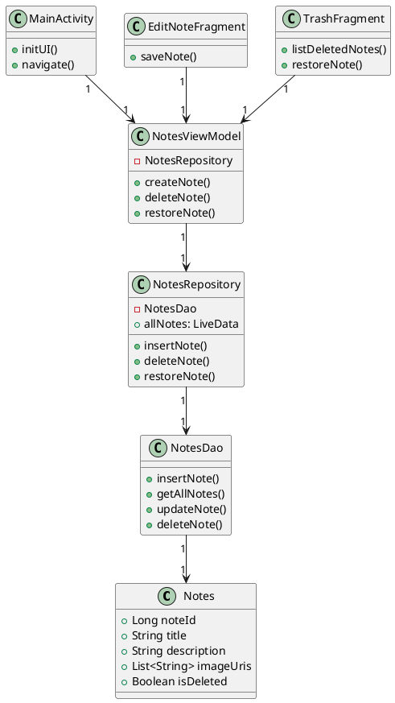

# Module AppNotas

## Descripción General
AppNotas es una aplicación para gestionar notas de manera intuitiva, con funciones avanzadas como adjuntar imágenes y restaurar notas eliminadas.

📌 **Para documentación técnica autoactualizable**, consulta [`NotesRepository`](../dokka/markdown/-app-notas/com.example.appnotas/[android-jvm]-notes-repository.md) y [`NotesViewModel`](../dokka/markdown/-app-notas/com.example.appnotas/[android-jvm]-notes-view-model.md).

---

## Requisitos Técnicos

📌 **Especificaciones:**

| Requisito | Versión |  
|-----------|---------|  
| **Android SDK Mínimo** | 24 |  
| **Versión de Kotlin** | 1.8.10 |  
| **Base de datos** | Room Database |  
| **Interfaz gráfica** | Material Design con ViewModel y LiveData |  

📌 **Dependencias principales:**

```kotlin
dependencies {
implementation ("androidx.lifecycle:lifecycle-viewmodel-ktx:2.6.1")
implementation ("androidx.room:room-runtime:2.5.0")
kapt ("androidx.room:room-compiler:2.5.0")
}

```

📌 **Clase de configuración:** [`SettingsManager`](../dokka/markdown/-app-notas/com.example.appnotas/[android-jvm]-settings-manager.md).

---

## Estructura de paquetes

📌 **Distribución del código:**

### **1. database**
- [`NotesRoomDatabase`](../dokka/markdown/-app-notas/com.example.appnotas/[android-jvm]-notes-room-database.md): Implementación de Room Database.
- [`NotesDao`](../dokka/markdown/-app-notas/com.example.appnotas/[android-jvm]-notes-dao.md): Manejo de operaciones CRUD.
- [`NotesRepository`](../dokka/markdown/-app-notas/com.example.appnotas/[android-jvm]-notes-repository.md): Acceso a los datos desde los ViewModels.

### **2. ui**
- [`MainActivity`](../dokka/markdown/-app-notas/com.example.appnotas/[android-jvm]-main-activity.md): Pantalla principal de gestión de notas.
- [`AllNotesFragment`](../dokka/markdown/-app-notas/com.example.appnotas/[android-jvm]-all-notes-fragment.md): Vista con todas las notas activas.
- [`EditNoteFragment`](../dokka/markdown/-app-notas/com.example.appnotas/[android-jvm]-edit-note-fragment.md): Edición y creación de notas.
- [`TrashFragment`](../dokka/markdown/-app-notas/com.example.appnotas/[android-jvm]-trash-fragment.md): Manejo de la papelera y restauración de notas.

### **3. seguridad**
- [`DatabaseEncryptionTest`](../dokka/markdown/-app-notas/com.example.appnotas/[android-jvm]-database-encryption-test.md): Prueba para verificar el cifrado de la base de datos.
- [`SQLInjectionTest`](../dokka/markdown/-app-notas/com.example.appnotas/[android-jvm]-sql-injection-test.md): Prueba de seguridad para detectar inyección SQL.

---

## Diagrama de Clases

📌 **Relación entre los elementos principales:**



📌 Documentación del modelo de datos: Notes.
🚀 Este módulo se documenta automáticamente con Dokka al ejecutar: 
```bash 
./gradlew dokkaMarkdown 
```

<!-- End of Module Documentation -->